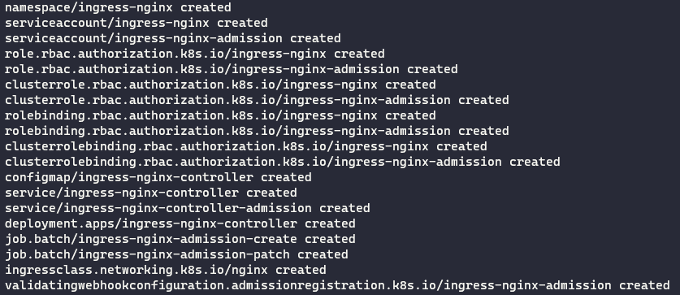

# msft-learnings

### AKS with Azure CNI Overlay

- Create AKS Cluster
```agsl
az aks create 
    --resource-group myResourceGroup 
    --name myAKSCluster 
    --location canadacentral
    --network-plugin azure
    --network-plugin-mode overlay
//    --service-cidr 10.0.0.0/16
//    --docker-bridge-address 172.17.0.1/16 
    --pod-cidr 10.244.0.0/16  
    --vnet-subnet-id <SUBNET_ID>  
```
- Attach an ACR to AKS  
`az aks update -n myAKSCluster -g myResourceGroup --attach-acr <acr-name>`
- Tag images and push to ACR   
```agsl
docker tag mcr.microsoft.com/oss/nginx/nginx:1.15.5-alpine myregistry.azurecr.io/samples/nginx
docker push myregistry.azurecr.io/samples/nginx
```
- Deploy to AKS using yaml / helm
- Expose the LB to a DNS (Private)

### Expose traffic with K8s community Ingress on AKS
https://github.com/nginxinc/kubernetes-ingress/tree/v3.1.0/deployments/helm-chart

Use an internal Load Balancer with a static IP address
```agsl
helm install nginx-ingress nginx-stable/nginx-ingress -f nginx-ingress.yaml -n nginx-ingress
```


### Secure k8s East-West traffic with Istio (Service Mesh)
https://docs.microsoft.com/en-us/azure/aks/servicemesh-istio-install?pivots=client-operating-system-linux

### Expose APis with API management and AKS over mTLS
1. External mode
2. Internal mode with Application Gateway
